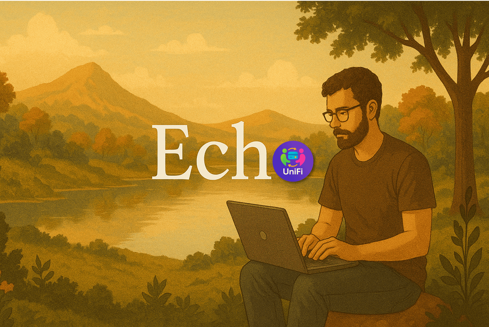

# UniFi Echo

> 🍃 Rooted in nature 🍁, 🌱 branching into decentralized finance — 🧑🏻‍💻 **echoing** ideas 💡 into a 🌍 borderless financial world.

  

## API

Need direct HTTP access? Jump into the REST API docs → [Open API Docs](./api-http/README.md)

## SDK

### Rust

Prefer type-safety and Rust-first workflows? Dive into our Rust SDK → [Rust SDK Guide](./sdk/)

#### Primitives

Used across the UniFi codebase and designed to help you seamlessly integrate UniFi into your own platform.

Follow [here](./primitives/)
