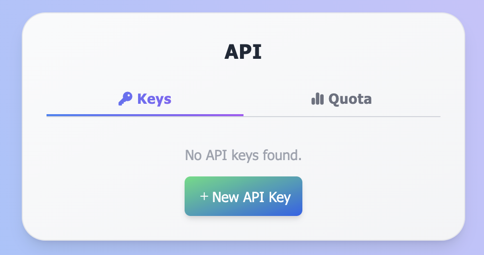
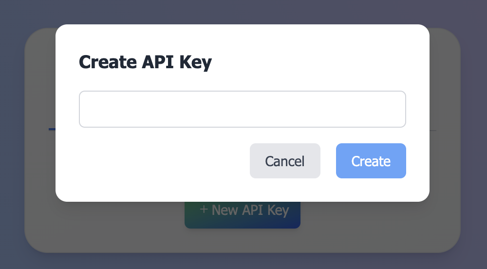
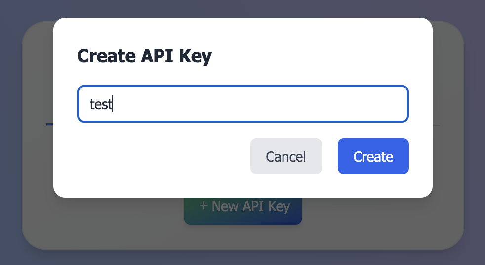
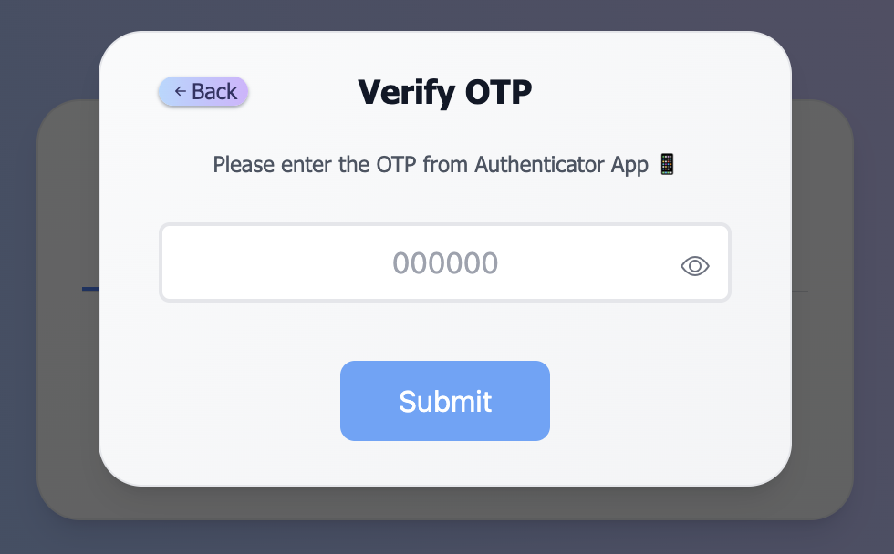
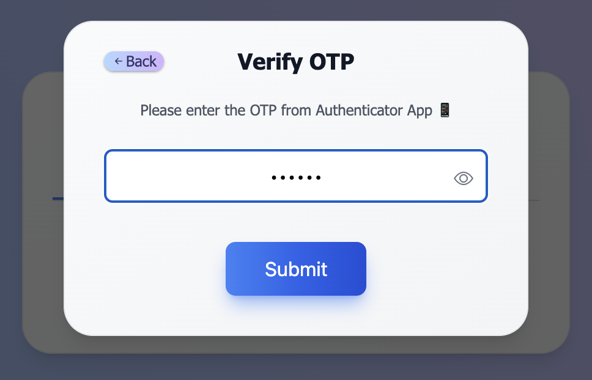
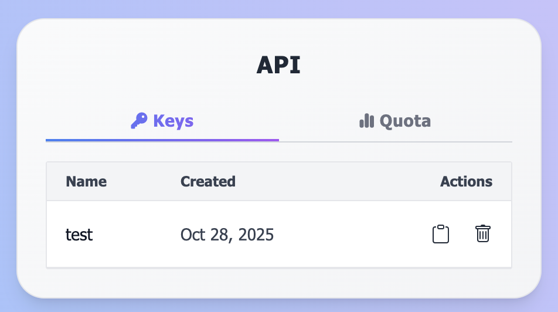
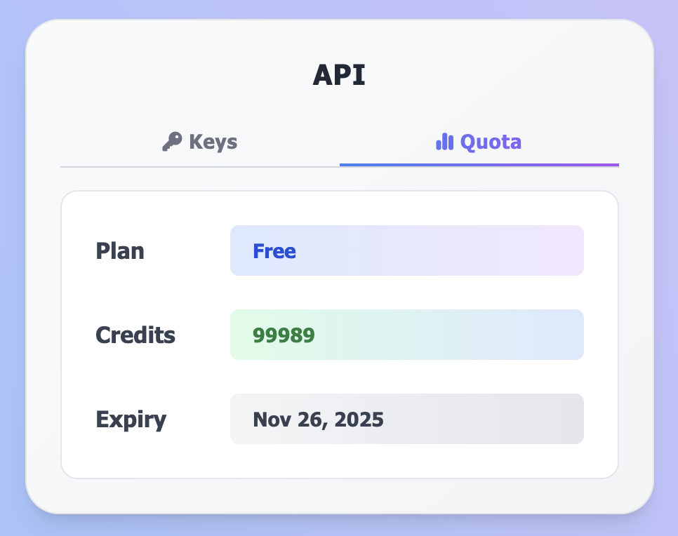
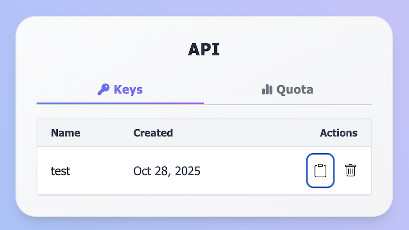
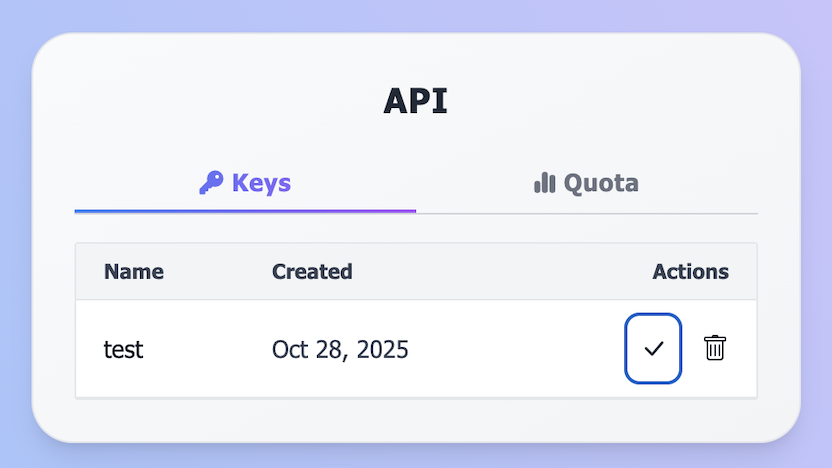

# API

## 🔑 Get Your API Key

To start using the UniFi API, you’ll need to create an API key.

1. **Open the API Dashboard**: \
👉 <https://prod.unifi-web3.pages.dev/api>
1. **Sign up or log in** (if you haven’t already).\
1. Once logged in, the dashboard will look like this 👇\
   Click on <kbd>**New API Key**</kbd> button to create a new key.

    <p align="left">
      
    </p>

1. **Name your key** (e.g., test), and click **Create**.

    <p align="left">
      
    </p>

    <p align="left">
      
    </p>
1. **Verify with 2FA OTP**: \
   Enter the OTP code from your Authenticator App (e.g., Google Authenticator, Microsoft Authenticator, etc.) to confirm your identity and proceed with key creation.

    <p align="left">
      
    </p>

    <p align="left">
      
    </p>

1. 🎉 Your API Key has been successfully created ✅. \
   You’ll now see it listed here on this page.

    <p align="left">
      
    </p>

1. **Monitor Your API Credits Usage** \
   You can track your remaining credits, expiry in real-time on the same dashboard.

    <p align="left">
      
    </p>

    > 💡 **Note:** The FREE plan includes **100,000 API credits** by default — perfect for testing and initial integration.

2. **Copy and Store Your API Key Securely** \
   Copy the key by clicking the **copy icon** and save it in a secure place (e.g., environment variable or secrets manager).   \
   You’ll need this key to authenticate all your API requests.

    <p align="left">
      
    </p>

    <p align="left">
      
    </p>

## ⚙️ Setup REST Client Environment

To simplify API testing in VS Code using the [REST Client extension](https://marketplace.visualstudio.com/items?itemName=humao.rest-client), create a workspace settings file:

> [!NOTE]
> Ensure the VSCode extension is installed in your VSCode editor.

File path:

```sh
.vscode/settings.json
```

### Sample configuration

```json
{
    "rest-client.environmentVariables": {
        "prod": {
            "base_url": "https://unifi-api-jlq9.onrender.com",
            "api_key": "YOUR_API_KEY"
        }
    }
}
```

Replace `YOUR_API_KEY` with your one. Refer [this](./api/README.md#-get-your-api-key)

### 🧭 Selecting the Environment

1. Open the Command Palette:
   - macOS: <kbd>Cmd + Shift + P</kbd>
   - Windows/Linux: <kbd>Ctrl + Shift + P</kbd>
2. Type and select **“Rest Client: Switch Environment”**.
3. Choose the environment — e.g., **prod**.

### 📦 Using the Variables

After selecting the environment, you can directly reference the variables inside your .http files:

```http
{{base_url}}
{{api_key}}
```

Example:

```http
GET {{base_url}}/v1/payments
Authorization: Bearer {{api_key}}
```
