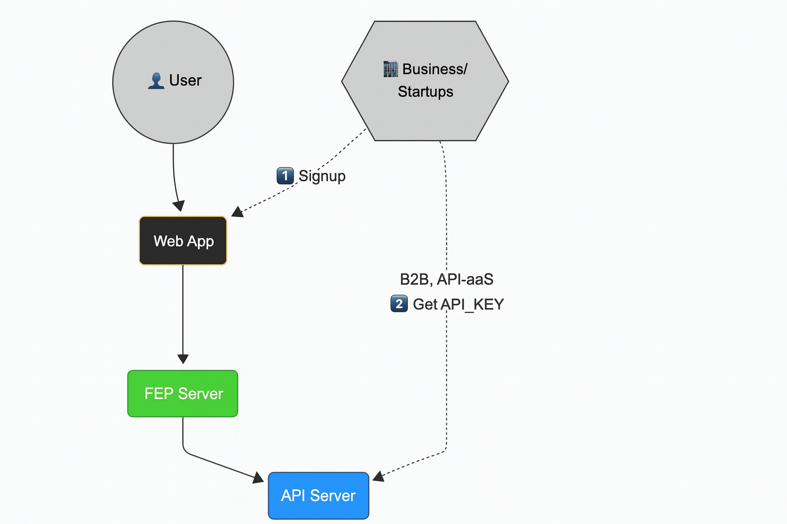

# API

## Background

🏢 **Businesses** & **Startups** integrate via **API-aaS**, getting instant access to UniFi’s low-cost, high-speed payment rails.

<p align="left">
  
</p>

Watch this [video](https://www.youtube.com/watch?v=KwZcMedBves) & launch post on [LinkedIn](https://www.linkedin.com/feed/update/urn:li:activity:7391379223107596289/?actorCompanyId=105053542) to see how quick the API integration is, for seamless stablecoin payments.

## 🔑 Get Your API Key

To use the UniFi API, you’ll first need to create an API key.

See the [public UniFi API reference](https://docs.payunifi.com/api-reference/) for instructions on creating an API key, along with the supported endpoints, request schemas, and response schemas.

## ⚙️ Setup REST Client Environment

To simplify API testing in VS Code using the [REST Client extension](https://marketplace.visualstudio.com/items?itemName=humao.rest-client), create a workspace settings file:

> [!NOTE]
> Ensure the VSCode extension is installed in your VSCode editor.

File path:

```sh
.vscode/settings.json
```

### Sample configuration

```json
{
    "rest-client.environmentVariables": {
        "prod": {
            "base_url": "https://api.payunifi.com",
            "api_key": "YOUR_API_KEY",
            "user_id": "YOUR_USER_ID"
        }
    }
}
```

Replace `YOUR_API_KEY` with your API key from the steps above.

### 🧭 Selecting the Environment

1. Open the Command Palette:
   - macOS: <kbd>Cmd + Shift + P</kbd>
   - Windows/Linux: <kbd>Ctrl + Shift + P</kbd>
2. Type and select **“Rest Client: Switch Environment”**.
3. Choose the environment — e.g., **prod**.

### 📦 Using the Variables

After selecting the environment, you can directly reference the variables inside your `.http` files [here](../api-http/):

```http
{{base_url}}
{{api_key}}
{{user_id}}
```

Example:

```http
GET {{base_url}}/health
Authorization: Bearer {{api_key}}
```

## Public request collections

The REST Client files in this folder mirror only the endpoints published in the
[public API reference](https://api.payunifi.com/):

- [Health](./health.http)
- [Deposit](./deposit.http)
- [Wallet](./wallet.http)
- [Preflight](./preflight.http)
- [Pay](./payment.http)
- [History](./history.http)

Authentication, API-key administration, Profile, Faucet, support, and other internal endpoints are
intentionally excluded from these public collections.
