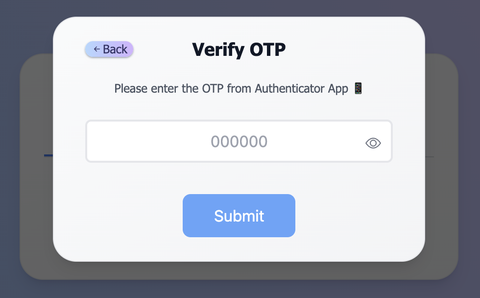

# API

## 🔑 Get Your API Key

To start using the UniFi API, you’ll need to create an API key.

1. **Open the API Dashboard**: \
👉 <https://prod.unifi-web3.pages.dev/api>
1. **Sign up or log in** (if you haven’t already).\
1. Once logged in, the dashboard will look like this 👇\
   Click on <kbd>**New API Key**</kbd> button to create a new key.

    

      
    

1. **Name your key** (e.g., test), and click **Create**.

    

      
    

    

      
    

1. **Verify with 2FA OTP**: \
   Enter the OTP code from your Authenticator App (e.g., Google Authenticator, Microsoft Authenticator, etc.) to confirm your identity and proceed with key creation.

    

      
    

    

      
    

1. 🎉 Your API Key has been successfully created ✅. \
   You’ll now see it listed here on this page.

    

      
    

1. **Monitor Your API Credits Usage** \
   You can track your remaining credits, expiry in real-time on the same dashboard.

    

      
    

    > 💡 **Note:** The FREE plan includes **100,000 API credits** by default — perfect for testing and initial integration.

2. **Copy and Store Your API Key Securely** \
   Copy the key by clicking the **copy icon** and save it in a secure place (e.g., environment variable or secrets manager).   \
   You’ll need this key to authenticate all your API requests.

    

      
    

    

      
    

